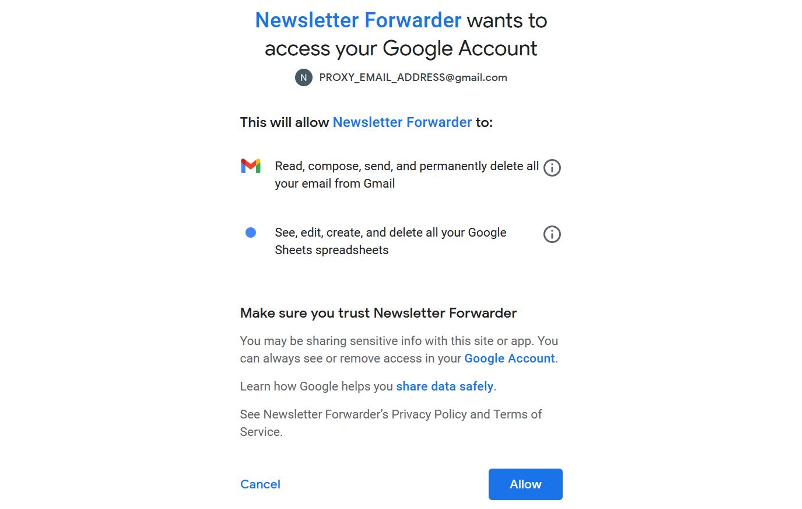

# Time-based forwarding of emails with Google Apps Script

A powerful and evolving service, [Google Apps Script](https://developers.google.com/apps-script) allows you to automate a wide range of workflows.

To explore its ability in helping you build productive applications, I will demonstrate a very simple example of how you can use it to search for specific emails and forward them at desired times.

In this scenario, suppose you have signed up to several online newsletters. These services send you daily emails, but you have no control over the time of day at which these emails are sent to you.

It may not suit you to receive email notifications in the mornings, or throughout the day, but rather, in the afternoons, which may better-suit your regular schedule.

For your own convenience, you can use Google Apps Script to achieve just this.

## Prerequisites

- Basic knowledge of [Gmail](https://www.google.com/gmail) and [Google Drive](https://www.google.com/drive/), and/or [spreadsheets](https://en.wikipedia.org/wiki/Spreadsheet)
- Any familiarity with [Google Apps Script](https://developers.google.com/apps-script), or a basic understanding of [JavaScript](https://en.wikipedia.org/wiki/JavaScript) or other [imperative language](https://en.wikipedia.org/wiki/Imperative_programming) (Apps Script is based on JavaScript)
- An [active Google account](https://accounts.google.com/signin), and/or the ability to [create an account](https://www.google.com/account/about/)

## Designing a solution

The first thing to consider is using a separate Google account to your primary one. In doing so, you can sign up to newsletters with that account, thereby preventing your personal account from receiving the email notifications at inconvenient times.

You can then build an Apps Script project in this "proxy" account to search for and forward the newsletters on a daily basis.

The [`GmailApp`](https://developers.google.com/apps-script/reference/gmail/gmail-app) provides the ability to search for emails using standard Gmail search parameters. Using this, it's very easy to retrieve the relevant newsletters from the inbox.

It also makes sense to use a [container-bound script](https://developers.google.com/apps-script/guides/bound) -- in particular, one linked to a Google Sheet containing the various search parameters.

Each time you sign up to a new newsletter, you can just update the spreadsheet with the corresponding search parameters without needing to modify the script itself. The [`SpreadsheetApp`](https://developers.google.com/apps-script/reference/spreadsheet/spreadsheet-app) can be used to interact with the sheet containing the data.

An obvious extension to this design is to forward emails to potentially multiple recipients rather than just yourself. To account for this, it's as simple as storing the recipient email addresses of interested parties in the Google Sheet alongside the corresponding newsletter search parameters.

## Tutorial

### Building the automation

To start off, [create a new blank Google Sheet](https://docs.google.com/spreadsheets/) in your "proxy" Google account's Drive. Click on the spreadsheet's default name "Untitled spreadsheet" and rename it to "Newsletter Forwarder".

We'll use the first column for the email search parameters, and the second column for the corresponding intended recipients.

The sheet could look something like this:


The search parameters filter emails within the last day, from a specific sender's domain and containing a relevant phrase in their subject. Check out [this Google Help page](https://support.google.com/mail/answer/7190) to learn more about the various search operators and how they work.

In parallel, we store the recipient emails as comma-separated lists, just as would be done when composing an email manually.

You should add a new row for each newsletter you want to forward, specifying the relevant search parameters and intended recipients in each case.

Next, we'll bound a new script by [opening the script editor](https://developers.google.com/apps-script/guides/bound#creating_a_bound_script). Click on the project's default name "Untitled project" and rename it to "Newsletter Forwarder".


It suffices for the code to live inside the default `Code.gs` file created.

One function will be enough for the script, which we'll call `main`:

```
function main() {
  /* Code */
}
```

Since we have only a single sheet, we can use [`getActiveSheet`](https://developers.google.com/apps-script/reference/spreadsheet/spreadsheet-app#getactivesheet) to retrieve data from it.

Initially, all we need to do is iterate over the first column (the search parameters) until we reach a row without any data.

A standard operation, we can call [`getRange`](https://developers.google.com/apps-script/reference/spreadsheet/sheet#getRange(Integer,Integer)) to access a specific cell and [`getValue`](https://developers.google.com/apps-script/reference/spreadsheet/range#getValue()) to retrieve the data in that cell.

Remembering to also skip the header row, one possible formulation could look like this:

```
const sheet = SpreadsheetApp.getActiveSheet();
let i = 2;
while (true) {
  const searchParameters = sheet.getRange(i, 1).getValue();
  if (!searchParameters) {
    break;
  }
  i++;
}
```

We can now [run a search query with the `GmailApp`](https://developers.google.com/apps-script/reference/gmail/gmail-app#searchquery), using the pre-defined search parameters:

```
const threads = GmailApp.search(searchParameters);
```

This returns all the matching email threads according to our query.

Finally, we retrieve the corresponding intended recipient emails from the sheet and [forward](https://developers.google.com/apps-script/reference/gmail/gmail-message#forwardrecipient) the [first message](https://developers.google.com/apps-script/reference/gmail/gmail-thread#getMessages()) in the first matching thread -- in the case there exists at least one matching thread.

```
if (threads.length) {
  const emails = sheet.getRange(i, 2).getValue();
  threads[0].getMessages()[0].forward(emails);
}
```

The overall script is rather neat and simple:

```
function main() {
  const sheet = SpreadsheetApp.getActiveSheet();
  let i = 2;
  while (true) {
    const searchParameters = sheet.getRange(i, 1).getValue();
    if (!searchParameters) {
      break;
    }
    const threads = GmailApp.search(searchParameters);
    if (threads.length) {
      const emails = sheet.getRange(i, 2).getValue();
      threads[0].getMessages()[0].forward(emails);
    }
    i++;
  }
}
```

### Testing the script

With the initial script now complete, we are ready to [test it out](https://developers.google.com/apps-script/guides/standalone#running_a_standalone_script). To do so, first click on the `Save` button just above the code editor and then click on `Run`.

After doing this, you will notice an "Authorization required" popup prompting you to grant certain permissions to the project. Click on `Review permissions`.

On the next popup, select your "proxy" Google account.

If a warning popup appears, click on `Advanced` and then `Go to Newsletter Forwarder (unsafe)`, but *be mindful of this in general, since [unverified apps](https://support.google.com/cloud/answer/7454865) may pose a threat to your personal data.*


Since our script reads information from a Google Sheet and sends emails, it will require the following two permissions:

1. Read, compose, send, and permanently delete all your email from Gmail.

2. See, edit, create, and delete all your Google Sheets spreadsheets.

As at the time of writing, these are the default permissions required when an Apps Script project makes use of the `GmailApp` and `SpreadsheetApp`, respectively.

They are quite broad and grant more than necessary; so once again, you should *be mindful of this in general and carefully review whether you genuinely trust the project's source.*



If you press `Allow`, the following three things will occur:

1. Your project will be given access to your Google Account, as per the above two permissions.
2. You will receive a "Security alert" email notification about the access granted to your project. You can [review and revoke](https://developers.google.com/apps-script/guides/services/authorization#revoking_access_rights) this access at any time.
3. If your inbox contains any emails matching the search parameters, they will be forwarded to the specified recipients as intended.

### Triggering notifications

Our goal is to run the script daily, in the afternoons. We can do so using an [installable trigger](https://developers.google.com/apps-script/guides/triggers/installable), which supports time-based events.

The trigger can be created manually or programmatically, but for the sake of simplicity we will [create it manually](https://developers.google.com/apps-script/guides/triggers/installable#managing_triggers_manually), as demonstrated below.


Select "Time-driven" as the event source and "Day timer" for the type of time.

A limitation of time-based triggers is that you can specify a one-hour range in which the script should run, but not the exact minute within that hour.

In particular, the [documentation](https://developers.google.com/apps-script/guides/triggers/installable#time-driven_triggers) specifies:

> The time may be slightly randomized — for example, if you create a recurring 9 a.m. trigger, Apps Script chooses a time between 9 a.m. and 10 a.m., then keeps that timing consistent from day to day so that 24 hours elapse before the trigger fires again.

Hence, you can choose a suitable *time range*, for example "5pm to 6pm", and the script will execute at some fixed (but randomly chosen) minute within that range each day.


Finally, in the event the script fails, you can configure failure notification emails to be sent at some frequency. I usually opt to receive them immediately.

Do note however, that these failure notifications will be sent to the "proxy" email address, not your personal email.

To receive the failure notifications immediately in your personal inbox, you can utilize Gmail's traditional forwarding rules.

You will want to [create a filter](https://support.google.com/mail/answer/6579#zippy=%2Ccreate-a-filter) to capture all emails from the address [apps-scripts-notifications@google.com](mailto:apps-scripts-notifications@google.com) and [forward](https://support.google.com/mail/answer/10957?hl=en#zippy=%2Cturn-automatic-fowarding-on-or-off) them to your own email.

Depending on your own use case, you should also be mindful of Google App Script's [resource quotas](https://developers.google.com/apps-script/guides/services/quotas).

---

The original sources are available on [GitHub](https://github.com/costaparas/Google-Apps-Script-Email-Forwarding).

*Please consider the environment before printing.*
